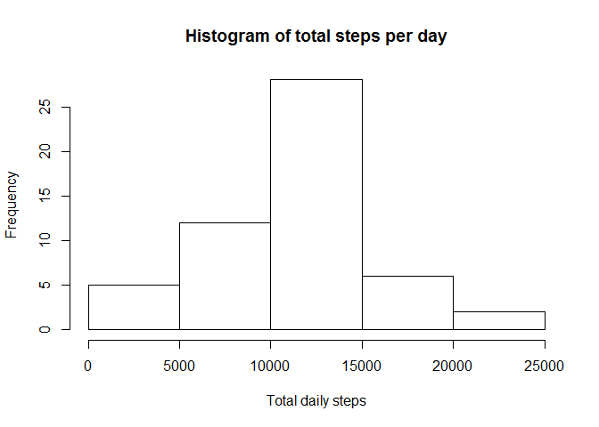
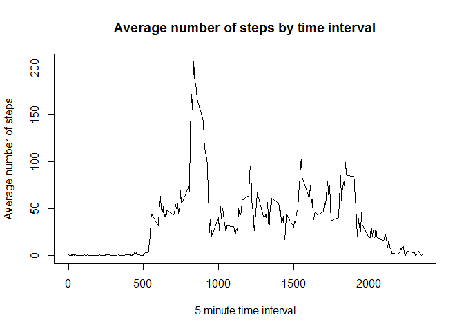
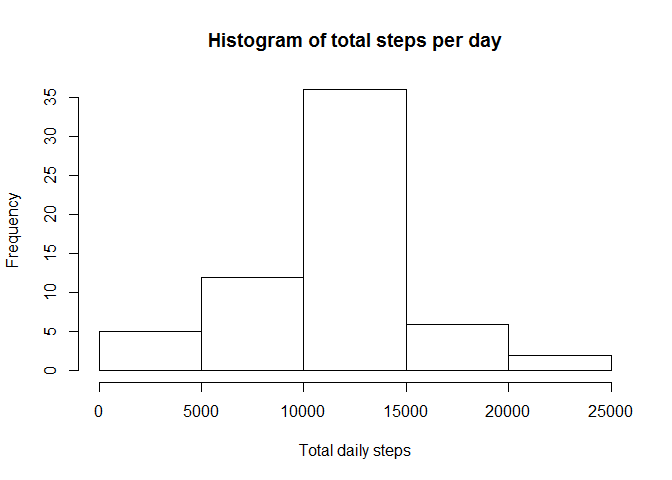
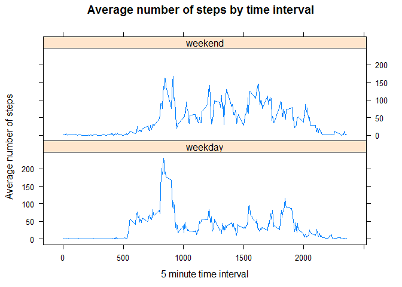

# Reproducible Research: Peer Assessment 1


## Loading and preprocessing the data


Unzip the compressed data file, then read it in to R.

```r
unzip("activity.zip")
activity <- read.csv("activity.csv")
```

Preprocessing

(Use the dplyr library)

- Produce a subset of the data with no NAs, grouped by date, for use in question 1. Call this data frame "activity_q1".
- With the same subset (no NAs), group by interval for question 2. Call this "activity_q2".


```r
library(dplyr)

activity_q1 <- activity %>%
  filter(!is.na(steps)) %>%
  group_by(date) %>%
  summarise(total_steps=sum(steps))

activity_q2 <- activity %>%
  filter(!is.na(steps)) %>%
  group_by(interval) %>%
  summarise(avg_steps=mean(steps))  
```


## What is mean total number of steps taken per day?


Use the activity_q1 dataframe for this question. First draw the histogram.


```r
hist(activity_q1$total_steps, 
     main="Histogram of total steps per day",
     xlab="Total daily steps")
```

 

Calculate mean and median daily steps.


```r
mean(activity_q1$total_steps)
```

```
## [1] 10766.19
```

```r
median(activity_q1$total_steps)
```

```
## [1] 10765
```

The mean number of steps per day is 1.0766189\times 10^{4} and the median is 10765.


## What is the average daily activity pattern?


Use activity_q2 for this question. First plot the graph.


```r
plot(activity_q2$interval, activity_q2$avg_steps, type="l",
     main="Average number of steps by time interval",
     xlab="5 minute time interval",
     ylab="Average number of steps")
```

 

Now find the value of "interval" where "avg_steps" takes its highest value.


```r
activity_q2$interval[activity_q2$avg_steps==max(activity_q2$avg_steps)]
```

```
## [1] 835
```

Interval number 835 has the highest mean number of steps.


## Imputing missing values


With the main "activity" dataframe, find the number of rows where steps is NA.


```r
nrow(activity[is.na(activity$steps),])
```

```
## [1] 2304
```

There are 2304 missing values in the dataset.

For all rows with missing steps impute the mean number of steps for that time interval. Copy activity to a new dataframe called activity_impute. Loop through all the rows of these dataframe, replacing steps with the mean value wherever there was an NA in the original dataframe. Use the data from question 2 as a lookup table for the means. 


```r
activity_impute <- activity
for(i in 1:nrow(activity))
  activity_impute$steps[i] <- ifelse(is.na(activity$steps[i]), 
      activity_q2$avg_steps[activity_q2$interval == activity$interval[i]], 
      activity$steps[i])
```

Draw a histogram from the new dataframe.


```r
activity_q3 <- activity_impute %>%
  group_by(date) %>%
  summarise(total_steps=sum(steps))

hist(activity_q3$total_steps, 
     main="Histogram of total steps per day",
     xlab="Total daily steps")
```

 

Calculate mean and median daily steps.


```r
mean(activity_q3$total_steps)
```

```
## [1] 10766.19
```

```r
median(activity_q3$total_steps)
```

```
## [1] 10766.19
```

The imputation method uses the mean number of steps per interval so the overall mean daily number of steps is unchanged. The median has changed slightly.


## Are there differences in activity patterns between weekdays and weekends?


First create the two level factor denoting weekday or weekend. The instructions suggest weekdays() but the lubridate package seems easier. With lubridate::wday(), Sunday == 1 and Saturday == 7.


```r
library(lubridate)
days <- factor(ifelse((wday(ymd(activity_impute$date))==1) | 
                      (wday(ymd(activity_impute$date))==7), "weekend", "weekday"), 
               levels=c("weekday", "weekend"))
activity_impute <- cbind(activity_impute, days)
```

Now summarise the data by interval and weekday / weekend and then plot time series graphs.


```r
activity_q4 <- activity_impute %>%
  group_by(interval, days) %>%
  summarise(avg_steps=mean(steps))

library(lattice)

with(activity_q4, print(
     xyplot(avg_steps~interval|days, type="l", layout=c(1,2),
            main="Average number of steps by time interval",
            xlab="5 minute time interval",
            ylab="Average number of steps")))
```

 
